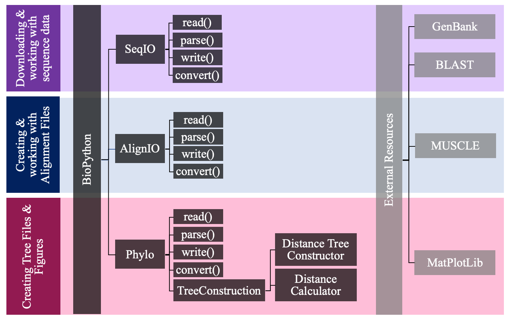
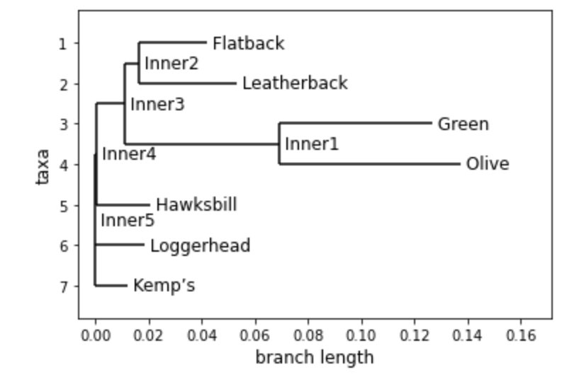
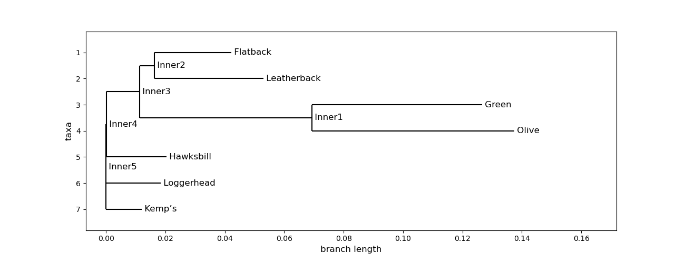

#### This tutorial will walk you through the steps of creating a phylogenetic tree using Jupyter Notebook, with Python as a programing language. These concepts can be utilized at the command line, however this tutorial is intended to be introductory, and is better visualized and conceptualized in Jupyter Notebook. 

---

# Python packages for working with phylogenetic data 

There are currently multiple packages that allow users to work with sequence data and create phylogenetic trees in python: 
- [BioPython:](https://biopython.org/) BioPython has many modules that allow the user to work with a variety of data types including sequence data, alignment files, and tree files and has the capacity create phylogenetic tree diagrams using [matplotlib.](https://matplotlib.org/)
- [TreeSwift:](https://www.sciencedirect.com/science/article/pii/S2352711019300767) The newest of these packages, Treeswift is designed to handle large tree datasets much more quickly than the others and run statistical analyses on the trees. However, it doesn't allow the user to create trees, work with sequence data, or directly edit the trees. 
- [DendroPy:](https://dendropy.org/) This python library also focuses on tree data, allowing users "simulate, process, and manipulate" trees. 
- [ETE Toolkit:](http://etetoolkit.org/) ETE provides the best framework for visualizing trees but does not support creating or editing trees. 

Each of these packages have different strengths at different steps in the process of creating and visualizing a phylogenetic tree. Here, we will use BioPython because it is the only package that allows us to work through the process from initial sequence data to a simple visualization of the tree. 

---

# Steps to creating phylogenetic trees 

1. Download and work with sequence data
2. Align sequence data and work with alignments
3. Working with tree data
4. Creating phylogenetic tree figures

This tutorial uses a number of different resources, in and outside of BioPython. Below is a flow chart showing which resources are used in which steps of the process. 

---

# 1. Downloading and Working with Sequence Data 

The most common place to download sequence data is from [GenBank](https://www.ncbi.nlm.nih.gov/genbank/), a federally funded database with all publically available partial or whole genome sequences. To download data from this website, you must first determine the following details for your analysis
- Which species 
- What part of the genome (eg. 16s, ...)
- What file format 

The [GenBank](https://www.ncbi.nlm.nih.gov/genbank/) website is easily navigable once you have determined these details, and will allow you to copy and paste data into a new file, or download sequence data in many different formats. 

### Sequence Data File Formats 

- **Raw:** sequence data without any description or other information  

        ttcctctttctcgactccatcttcgcggtagctgggaccgccgttcagtcgc

- **FASTA:** The most commonly used format, and the one we will use for this tutorial, the first line of each sequence starts with `>` and includes an ID code and other information

        >ID_code some other comment
        ttcctctttctcgactccatcttcgcggtagct

- **GenBank:** contains lots of detailed information about the sequence

        LOCUS       DQ078310                1250 bp    mRNA    linear   INV 26-JUL-2016
        DEFINITION  Littorina littorea p38 MAPK mRNA, partial cds.
        ACCESSION   DQ078310
        VERSION     DQ078310.1
        ...
        ORIGIN      
        1 taccaaatgc tgtctcccat cggtgtagga gcttacggcc aagtcgtgtc gtcatacgac
        61 caggaaagtg atacaaaggt ggccatcaag aaactagccc gtccgttcca gacagccata
        ...

- Other popular data formats can be found [here](http://emboss.sourceforge.net/docs/themes/SequenceFormats.html). 

### Identifying sequence data 

If you already have sequence data and you wish to figure out what species or part of the genome it belongs to, you can use BLAST to locate it. 
The BLAST [website](https://blast.ncbi.nlm.nih.gov/Blast.cgi) allows users to search for sequences in a database containing all open-access sequences. 
There is also a Biopython (package)[https://biopython.org/docs/1.75/api/Bio.Blast.html] to use BLAST. 

### Downloading pre-made trees

If you are doing a simple analysis, you may wish to skip the sequence allignment process, and simply use trees that are already available open-source platforms or with published in a journal article. To do this, you can download one of the file types discussed in the "Tree file formats and uploading data" section below. This type of data can be downloaded from websites such as the following: 

1. [Interactive Tree of Life](https://itol.embl.de/)
2. [Open Tree of Life](https://tree.opentreeoflife.org/)
3. [Treebase](https://www.treebase.org/)
4. [Phylome DB](http://phylomedb.org/)

### Working with sequence data in BioPython 
BioPython has a module called SeqIO, which allows the user to manipulate, read, and write sequence files. The main functions for this and the following modules are `read()`, `parse()`, `write()` and `convert()`. 

#### Import the SeqIO module from Bio Python 
        import Bio as Bio
        from Bio import SeqIO

#### SeqIO.read() reads a single sequence from a file
The first argument is the file and the second is the format 

        s1 = SeqIO.read("sequence1.fasta", "fasta")
        s2 = SeqIO.read("sequence2.fasta", "fasta")

#### SeqIO.parse() reads multiple sequences from a file 

        raw_fasta = SeqIO.parse("whales.fasta", "fasta")
        print(list_fasta)`

However, the easiest way to work with this data is to convert it into a list. From there, you can print and read each sequence and it's detials. 

        list_fasta = list(SeqIO.parse("whales.fasta", "fasta"))
        print(list_fasta)
       
#### Helpful commands for reading and understanding the file

To print a list of all the IDs in a fasta file

        for record in SeqIO.parse("sequences.fasta", "fasta"):
          print(record.id)
        
To find out the current ID of a sequence

        print(s1.id)
        
To read the full description on your fasta file 

        print(s1.description)
        
To change an ID name

        s1.id = 'Balaenoptera acutorostrata'
      
      
#### SeqIO.write() is used to write a new file from one or more existing sequences
This step should also be used if the id names were edited in python and need to be saved to a file

        SeqIO.write([s1, s2], "sequences.fasta", "fasta")

#### SeqIO.convert() allows 

        SeqIO.convert("sequence1.fasta", "fasta", "new_sequence.fastq", "fastq")
        
#### Other helpful functions in SeqIO that we don't need for this analysis 
Write a sequence by hand 

        new_sequence = Seq("AAGGAACTG", generic_dna)

Transcribe from DNA to RNA
        
        transcribed = new_sequence.transcribe() 

Translate from DNA or RNA to a protein sequence 

        translated = transcribed.translate() 
        translated = transcribed.translate(to_stop=True) #stop at a stop codon 

Sequences can be manipulated like strings; they are immutable but can be indexed 
        
        combined = seq1 + seq2 

---

# 2. Aligning Sequence Data 

#### Creating alignments
The easiest way to create an alignment is to use the very popular tool [MUSCLE](https://www.ebi.ac.uk/Tools/msa/muscle/ ). 
Biopython does have a [module](https://biopython-tutorial.readthedocs.io/en/latest/notebooks/06%20-%20Multiple%20Sequence%20Alignment%20objects.html]) to run MUSCLE at the command line, but it seems to need some updating as it was written for Python 2, and is generally much more complicated than using the online MUSCLE interface. 

#### AlignIO is a module in BioPython that works with Alignment files 

        import Bio as Bio 
        from Bio import AlignIO

#### AlignIO.read() is used to read single alignments
AlignIO.parse() is used the same way to read a file with multiple alinments 

    with open("whales.aln","r") as aln: 
    	alignment = AlignIO.read(aln,"clustal")
    print(type(alignment))

To print information on each of the records in an alignment

        for record in align1:
         print(record)
    
#### AlignIO.write() can be used to write multiple single alignments into one file 
Note that this is best supported by the Phylip file format

        my_alignments = [align1, align2]
        AlignIO.write(my_alignments, "my_example.phy", "phylip")

#### AlignIO.convert() will change the format of an alignment file 
        
        converted = AlignIO.convert("data/PF05371_seed.sth", "stockholm", "PF05371_seed.aln", "clustal")

---

# 3. Create Phylogenetic Tree Datasets 

#### The Bio.pyhlo package has a calculator that allows users to calculate their own trees based on a variety of models

        from Bio import Phylo
        from Bio.Phylo.TreeConstruction import DistanceCalculator 

The distance calculator hosts a large number of different models for the tree construction 

        models= ['identity', 'blastn', 'trans', 'benner6', 'benner22', 'benner74', 'blosum100', 'blosum30', 'blosum35', 'blosum40', 'blosum45', 'blosum50',
        'blosum55', 'blosum60', 'blosum62', 'blosum65', 'blosum70', 'blosum75', 'blosum80', 'blosum85', 'blosum90', 'blosum95', 'feng', 'fitch', 'genetic', 
        'gonnet', 'grant', 'ident', 'johnson', 'levin', 'mclach', 'miyata', 'nwsgappep', 'pam120', 'pam180', 'pam250', 'pam30', 'pam300', 'pam60', 'pam90', 
        'rao', 'risler', 'structure']

For this analysis, we will use the 'identity' model

        distance_matrix = calculator.get_distance(alignment)
        print(distance_matrix)

The distance matrix looks something like this

        MF409242.1:1114-2689	0
        AB481392.1	0.531012658227848	0
        AB481394.1	0.530379746835443	0.02468354430379749	0
        AP006466.1:1122-2698	0.060126582278481	0.5341772151898734	0.5335443037974683	0
        AB481389.1	0.5322784810126582	0.02468354430379749	0.027848101265822822	0.519620253164557	0
        U13103.1	0.6816455696202532	0.19493670886075953	0.19873417721518982	0.679113924050633	0.1936708860759494	0
        AP006470.1:1118-2696	0.042405063291139244	0.5272151898734176	0.5278481012658227	0.04556962025316458	0.5291139240506328	0.6784810126582279	0
        AB201259.1:1118-2696	0.04303797468354431	0.5291139240506328	0.5297468354430379	0.046202531645569644	0.5265822784810126	0.6784810126582279	0.015189873417721489	0
        AB201258.1:1117-2694	0.04493670886075951	0.5284810126582278	0.530379746835443	0.04303797468354431	0.5272151898734176	0.6784810126582279	0.017721518987341756	0.012658227848101222	0
	MF409242.1:1114-2689	AB481392.1	AB481394.1	AP006466.1:1122-2698	AB481389.1	U13103.1	AP006470.1:1118-2696	AB201259.1:1118-2696	AB201258.1:1117-2694

Next, we need to construct the tree using a second module in the tree construction package

        from Bio.Phylo.TreeConstruction import DistanceTreeConstructor
        constructor = DistanceTreeConstructor(calculator)

Once we create the object, we can then build the tree 

        tree = constructor.build_tree(alignment)
        print(tree)

Printing this returns an organized summary of the tree

        Tree(rooted=True)
           Clade(branch_length=0, name='Inner7')
              Clade(branch_length=0.0021657436708860875, name='Inner6')
               Clade(branch_length=0.00881131329113926, name='Inner5')
                    Clade(branch_length=0.026331751054852318, name='MF409242.1:1114-2689')
                        Clade(branch_length=0.005551160337552749, name='Inner4')
                          Clade(branch_length=0.023753955696202533, name='AP006466.1:1122-2698')
                          Clade(branch_length=0.48154667721518984, name='Inner3')
                             Clade(branch_length=0.17295886075949374, name='U13103.1')
                           Clade(branch_length=0.009161392405063223, name='Inner2')
                                    Clade(branch_length=0.011524261603375524, name='AB481389.1')
                                Clade(branch_length=0.002399789029535887, name='Inner1')
                                        Clade(branch_length=0.012974683544303811, name='AB481394.1')
                                        Clade(branch_length=0.011708860759493678, name='AB481392.1')
                Clade(branch_length=0.007960838607594924, name='AP006470.1:1118-2696')
                Clade(branch_length=0.005646756329113899, name='AB201259.1:1118-2696')
                Clade(branch_length=0.007011471518987324, name='AB201258.1:1117-2694')

#### Like SeqIO and AlignIO, Bio.Phylo uses the commands read(), parse(), write(), convert()
These commands follow the same format as before: read() only reads one tree in a file, but parse() reads multiple

	tree = Phylo.read("tree1.nex", "nexus")

Files can be converted between different file formats

	Phylo.convert("tree.nex", "nexus", "example.xml", "phyloxml")

- Newick
- Nexus 
- NeXML
- Phyloxml 

Write the new file
	
	Phylo.write(tree, "tree.xml", "phyloxml")

The following commands can be used to look at the nodes and leaves of your tree

	tree.get_nonterminals()
	tree.get_terminals()

---

# 4. Creating Phylogenetic Tree Figures

Bio.Phylo works directly with [matplotlib](https://matplotlib.org/) and [pyplot](https://matplotlib.org/api/pyplot_api.html) to draw trees

	import matplotlib
	import matplotlib.pyplot as plt

To draw a simple, base tree you can use the simple command Phylo.draw()

	fig = Phylo.draw(turtle_tree)
	
However, depending on the size of the tree, this may not be easy to read

You can also use Phylo.draw_ascii(tree) to quickly view the tree 

	         ___________ Flatback
	       _|
	      | |_________________ Leatherback
	  ____|
	 |    |                           __________________________ Green
	 |    |__________________________|
	 |                               |________________________________ Olive
	 |
	_|________ Hawksbill
	 |
	 |_______ Loggerhead
	 |
	 |____ Kemp’s

Here is an example of code in MatPlotLib that cleans up the cladogram 

	fig = plt.figure(figsize=(13, 5), dpi=100) # create figure & set the size 
	matplotlib.rc('font', size=12)             # fontsize of the leaf and node labels 
	matplotlib.rc('xtick', labelsize=10)       # fontsize of the tick labels
	matplotlib.rc('ytick', labelsize=10)       # fontsize of the tick labels
	#turtle_tree.ladderize()		   # optional way to reformat your tree 
	axes = fig.add_subplot(1, 1, 1)
	Phylo.draw(turtle_tree, axes=axes)
	fig.savefig("turtles_cladogram")

---

# Conclusion

There are a number of functions provided in BioPython and other Python packages that are not explored here. For a scientific publiction, the tree file would normally be exported and formatted to be more professional in annother program such as the [ETE toolkit](http://etetoolkit.org/) or [Figtree](http://tree.bio.ed.ac.uk/software/figtree/). 

This tutorial also does not explore [consensus trees, bootstrapping](https://biopython.org/docs/1.75/api/Bio.Phylo.Consensus.html) or statistical analyses in phylogenetics (which are not supported in BioPython, but can be done in [TreeSwift](https://pypi.org/project/treeswift/) or [DendroPy](https://dendropy.org/primer/treestats.html). 

The ocean of phylogenetics is vast and constantly expanding, but hopefully this tutorial allowed you to dip your toes in! 

---

# Sources
1. [Tree of life image](https://www.researchgate.net/figure/Phylogenetic-tree-of-the-Animal-kingdom-2_fig1_314095464)
2. http://emboss.sourceforge.net/docs/themes/SequenceFormats.html
3. https://medium.com/@wvsharber/introduction-to-genbank-and-bioinformatics-with-python-8a25a0f15e3f
4. https://towardsdatascience.com/introduction-to-sequence-alignments-with-biopython-f3b6375095db
5. https://biopython.org/wiki/Phylo_cookbook
6. https://tree.opentreeoflife.org/opentree/opentree12.3@mrcaott800329ott800331/Balaenoptera-borealis--Balaenoptera-brydei
7. https://github.com/peterjc/biopython_workshop/blob/master/reading_writing_alignments/README.rst

---

Page template forked from <a href="https://github.com/evanca/quick-portfolio">evanca</a>

<!-- Remove above link if you don't want to attibute -->
